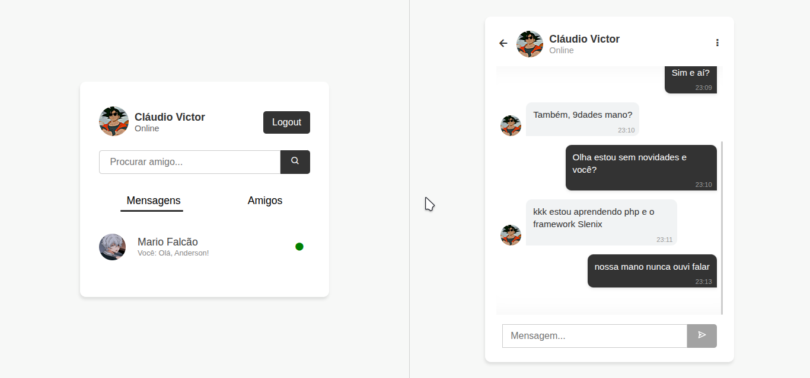
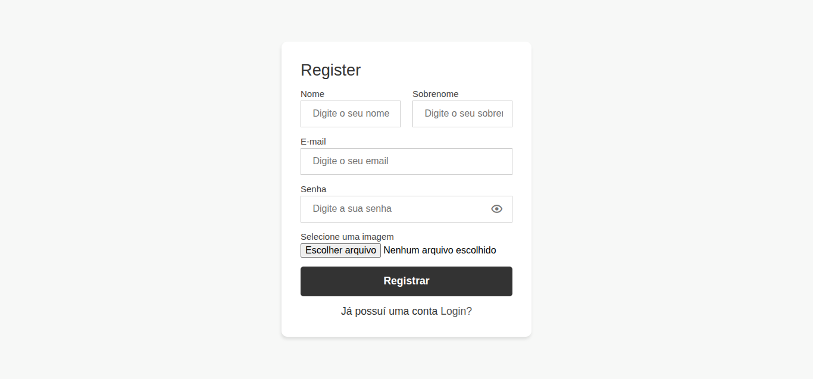
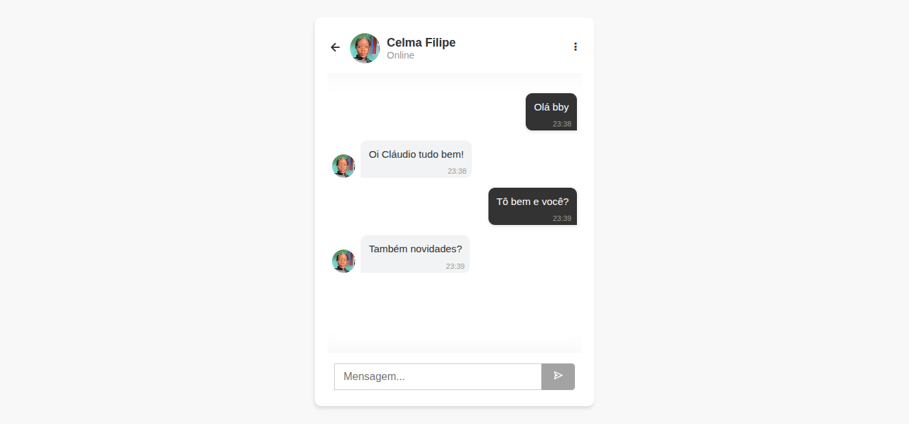
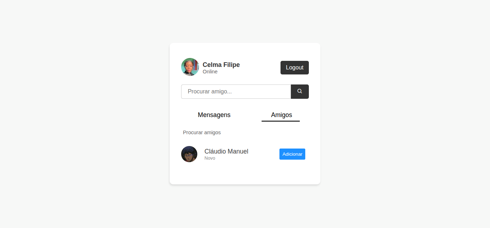

# 💬 ChatApp com Slenix Framework

Um sistema de **chat em tempo real** desenvolvido com o microframework **Slenix** (PHP MVC).  
O projeto inclui autenticação de usuários com **sessões**, sistema de amigos, troca de mensagens e interface moderna.



## 🚀 Funcionalidades

- Registro e login de usuários (com proteção CSRF)
- Autenticação baseada em **sessões**
- Adicionar e aceitar amigos
- Enviar e receber mensagens
- Listagem de conversas recentes
- Status **online/offline**
- Interface simples, responsiva e moderna

---

## 📸 Screenshots

| Login | Chat | Lista de Amigos |
|-------|------|-----------------|
|  |  |  |

---


---

## 🛠️ Tecnologias

- [PHP 8+](https://www.php.net/)
- [Slenix Framework](https://gitlab.com/claudiovictors/slenix)
- [Composer](https://getcomposer.org/)
- Banco de dados: **MySQL**
- Frontend: HTML, CSS, JS, [Boxicons](https://boxicons.com/)

---

## ⚙️ Instalação

Clone o repositório:

```bash
git clone https://gitlab.com/claudiovictors/chatapp.git
cd chatapp
```

#### Instale as dependências:
```bash
composer install
```

#### Configure o arquivo .env

```bash
APP_NAME=ChatApp
APP_ENV=local
APP_DEBUG=true

DB_CONNECTION=mysql
DB_HOST=127.0.0.1
DB_PORT=3306
DB_DATABASE=chatapp
DB_USERNAME=root
DB_PASSWORD=secret
```


#### Importe o banco de dados:

```bash
mysql -u root -p chatapp < public/db/chatapp.sql
```

Execute o servidor embutido do Slenix:

```bash
php slenix serve
```

Acesse em:
👉 http://localhost:8000